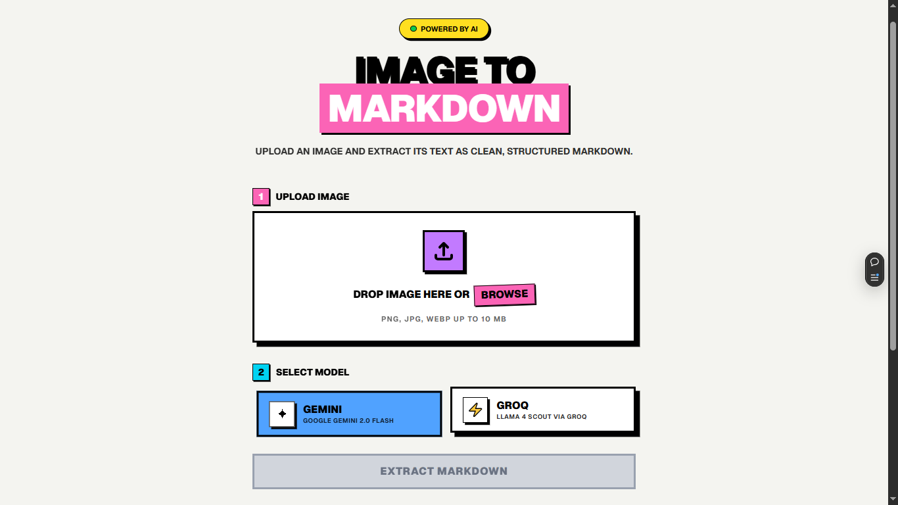

# Image to Markdown AI 📄🤖



A web application that takes any uploaded image containing text and seamlessly converts it into clean, structured Markdown using powerful Vision LLMs (Google Gemini 2.0 & Llama 4 Scout via Groq).

Built with **Next.js**, **Vercel AI SDK**, and **Tailwind CSS**, featuring a bold, Gumroad-inspired **Neubrutalism** user interface.

## ✨ Features
- **Accurate Text Extraction**: Recognizes paragraphs, heading hierarchies, bullet points, and code blocks directly from screenshots/images.
- **Multiple AI Models**: Switch between `Gemini 2.0 Flash` (via Google) and `Llama 4 Scout` (via Groq) on the fly.
- **Neubrutalist UI**: A fun, highly-tactile design featuring heavy black borders, hard block shadows, vibrant colors, and click-depth animations.
- **Drag & Drop**: Easily drop images directly into the browser.
- **1-Click Copy**: Copy the generated markdown to your clipboard instantly.

---

## 🚀 How to Use / Run Locally

### 1. Prerequisites
Ensure you have the following installed on your machine:
- [Node.js](https://nodejs.org/en/) (v18 or newer)
- [pnpm](https://pnpm.io/) (or npm/yarn)

### 2. Clone the Repository
```bash
git clone https://github.com/khalidkhankakar/image-to-md
cd image-to-md
```

### 3. Install Dependencies
```bash
pnpm install
```

### 4. Setup Environment Variables
Create a file named `.env.local` in the root of the project:
```bash
touch .env.local
```
Open it and add your API keys:
```env
# Get this from Google AI Studio (https://aistudio.google.com/)
GOOGLE_GENERATIVE_AI_API_KEY=your_gemini_api_key_here

# Get this from Groq Cloud (https://console.groq.com/keys)
GROQ_API_KEY=your_groq_api_key_here
```

### 5. Start the Development Server
```bash
pnpm run dev
```

Open your browser and navigate to exactly `http://localhost:3000` (or whichever port Next.js assigns if 3000 is taken) to use the app!

---

## 🛠 Tech Stack
- **Framework:** [Next.js (App Router)](https://nextjs.org/)
- **Styling:** [Tailwind CSS v4](https://tailwindcss.com/)
- **AI Integration:** [Vercel AI SDK](https://sdk.vercel.ai/docs)
- **Providers:** `@ai-sdk/google` & `@ai-sdk/groq`

